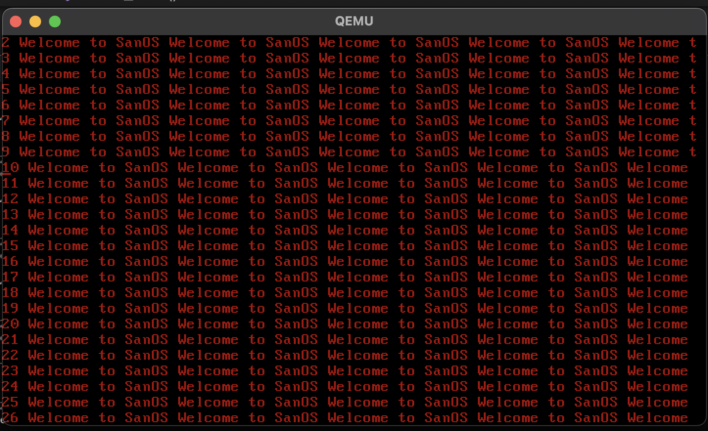

You might be wondering what is this repo: 

## What is sanOS ?

sanOS at this stage is a basic grub loaded OS, with a VGA driver that print strings on to the screen, like a teleprompter, where it rolls the least recently typed line out of the view for the upcoming line
For example in the image, there is no line Starting with "1 Welcome..", instead it is rolled over to make space for "26 Welcome..."

## Final goal
The final goal is to make sanOS, self hosted, where sanOS is written in inside of it's own, there is long way to go

## How to understand the code 
The best way is to follow the commit history, and the comments in the code 
The future plan is to write documentation along with the code